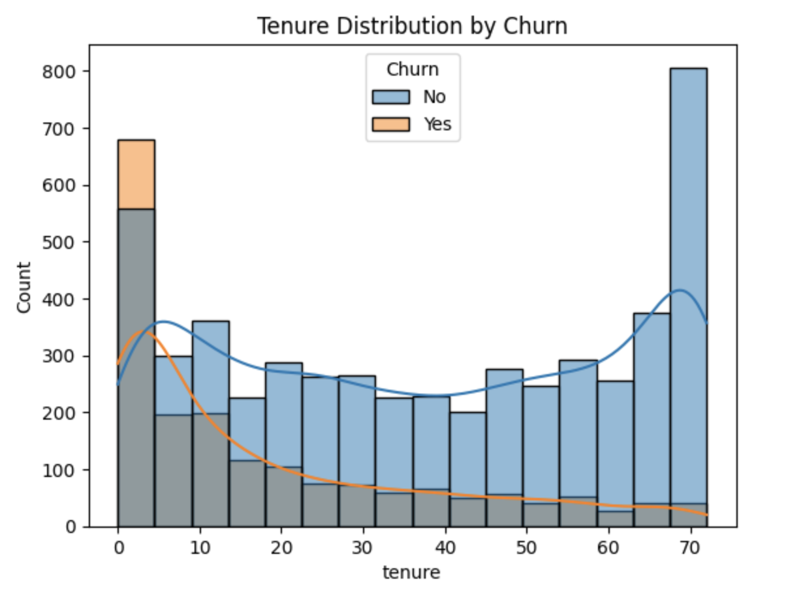
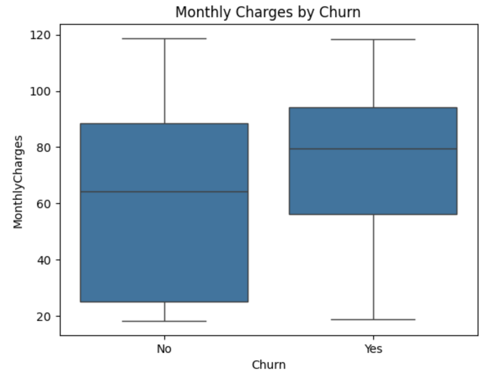
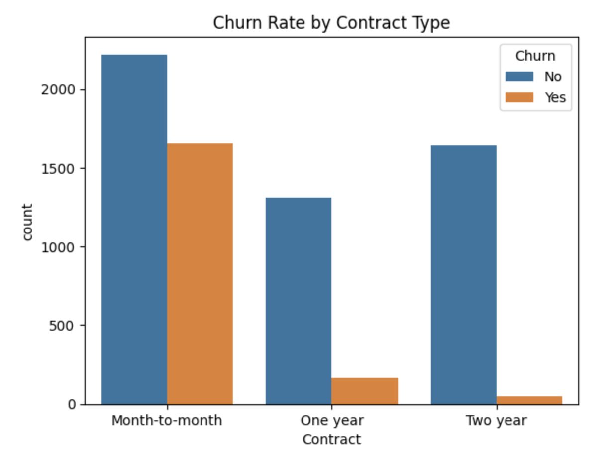

# 📊 Customer Churn Prediction

This project builds a machine learning model to predict whether a customer will churn based on a real-world telco dataset.

## 📁 Dataset

- [Telco Customer Churn](https://www.kaggle.com/blastchar/telco-customer-churn) (from Kaggle)
- **Number of rows**: 7,043
- **Number of columns**: 21

## 🔧 Technologies Used

- Python (Pandas, NumPy, Matplotlib, Seaborn)
- Scikit-learn
- XGBoost

## 🧼 Workflow

1. Load and clean the dataset
2. Perform EDA (visualize churn patterns)
3. Preprocess features (encoding, scaling)
4. Train multiple models
5. Evaluate and compare performance

## 📈 Models

- Logistic Regression
- Decision Tree Classifier
- XGBoost Classifier

## 📊 Churn Distribution

- **Churned Customers**: 1,869 (Approximately 26.5%)
- **Non-Churned Customers**: 5,174 (Approximately 73.5%)

## 📊 Contract Type Breakdown

- **Month-to-month**: 42.7% churn rate
- **One year**: 11.3% churn rate
- **Two year**: 2.8% churn rate

## 📊 Internet Service Type Distribution

- **DSL**: 19%
- **Fiber Optic**: 41.9%
- **No Internet Service**: 7.4%

## 💡 Key Insights

- Customers with **short tenure** are significantly more likely to churn.
- Customers on **month-to-month contracts** have the highest churn rate, while those on **two-year contracts** are least likely to churn.
- **Higher monthly charges** correlate with a higher churn probability.
- Retention strategies should focus on:
  - Offering incentives for long-term contracts.
  - Reducing costs or providing additional value to customers with higher monthly charges.
  - Creating targeted campaigns for new customers during their early months.

These insights can help telco companies design effective churn prevention programs.

## 📂 How to Run

```bash
pip install -r requirements.txt
jupyter notebook
```

## 📊 Sample Visuals

1. Tenure Distribution by Churn
   This plot shows that customers with lower tenure tend to churn more frequently, while customers with longer tenure are less likely to churn.
   

2. Monthly Charges by Churn
   Higher monthly charges are associated with a higher churn rate, as shown by the right-hand boxplot.
   

3. Churn Rate by Contract Type
   Month-to-month contracts have significantly higher churn rates compared to longer-term contracts (one-year or two-year).
   

## 📬 Contact

Made with ❤️ by Ting Ya Chang
mail: letitiachang0807@gmail.com
